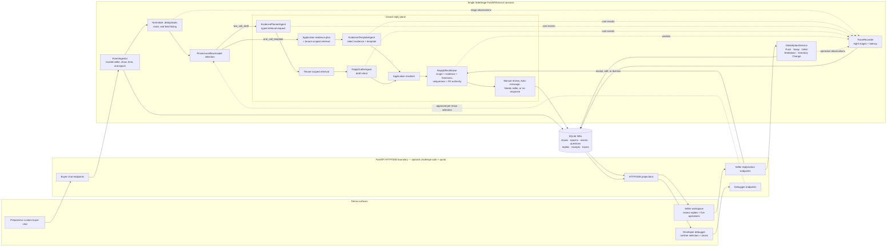

# SideStage Technical Design Document

> Status: `Accepted` — the local P0 runtime and deterministic safety contracts are `Verified`; the stateful reviewer application is committed at `6c8afeb` with the disk-compatible Render Blueprint correction at `f7d03ab`, while authenticated remote end-to-end verification and the credentialed live-model latency gate remain open
>
> Last updated: 2026-08-19
>
> Milestone 2 terminal implementation commit: `734d151`
>
> Live-Selling Copilot Adapter (M3B) runtime commit: `7d6c349`; replay/evaluation commit: `6ba208a`; optimization/DBG-023 commit: `12f3bab`
>
> Current deterministic P0 evidence: `uv run pytest -q` -> `380 passed, 5 deselected in 80.69s` at `6c8afeb`
>
> Stateful reviewer application commit: `6c8afeb`; Render Blueprint correction: `f7d03ab`
>
> Live run command: `uv run uvicorn sidestage.app:create_live_app --factory --host 127.0.0.1 --port 8000` after exporting the required model environment
>
> Test command: `uv run pytest -q`
>
> Primary depth: Agentic outbound-reply write safety under live state changes

## 1. Scope and technical goals

The implementation separates a domain-neutral `StaticAgentCore` from two concrete SideStage workflow modules. The core is a small asynchronous Python single-step agent harness: each `run()` accepts one immutable task with preassembled context, makes exactly one model request, validates exactly one statically registered terminal call, and returns a typed result. `one_call_template` registers one `EvidenceTemplateAgent`, builds a question-aware bounded evidence bundle before its only call, and asks that agent to select both evidence IDs and a versioned server-owned template. `two_call_draft` registers `EvidencePlannerAgent` and `ReplyDrafterAgent`; deterministic targeted retrieval runs between their two core calls. Both use the same routing, temporal binding, deterministic variant resolver, broker, persistence, and SLO boundary. The Optimization and Debug Session extension adds a closed startup catalog and per-show runtime selection among its immutable entries; it does not add a generic workflow object, user-authored registry, workflow engine, dynamic tool discovery, multi-turn continuation, cross-task memory, automatic provider/model fallback, or model effect authority.

### M3 terminology

| Milestone shorthand | Plain-language term | Responsibility |
| --- | --- | --- |
| **M3A — Reusable Agent Harness** | Product-neutral static Python agent runtime and evaluation harness | Owns immutable profile registration, task admission, FIFO scheduling, one provider request per task, terminal-call validation, typed results/failures, generic tracing, and independent scripted/live evaluation. It does not import seller, listing, inventory, policy, reply, or marketplace concepts and can be built and tested without M1 or M2. |
| **M3B — Live-Selling Copilot Adapter** | SideStage's live-commerce adaptation of the reusable harness | Projects trusted seller/show/listing context into registered reply tasks; owns routing, retrieval, the one-call and two-call workflows, deterministic variant resolution, reply broker and effects, Manual review/Auto-message behavior, livesell pressure evaluation, and Ledger traces. It depends on the M1 data contracts, M2 marketplace runtime, and M3A harness. |

Numbered labels such as M3A.1–M3A.4 and M3B.1–M3B.6 remain below only to preserve milestone, commit, test, and evidence traceability. In product-language discussion, this TDD uses **Reusable Agent Harness** and **Live-Selling Copilot Adapter**.

All catalogs, policies, listings, inventories, chat events, and custom messages are synthetic mock test data. The prototype does not ingest real customer data or claim a production retention policy. Credentials and environment secrets must never enter event or trace payloads.

This is the accepted design contract. Concrete implementation file maps, function names, commands, and measured results are added only after they exist.

### P0 implementation audit

The current code implements the original P0 UI/marketplace design and the later approved Copilot, debugger, reset, runtime-selection, and protected-reviewer extensions. The deterministic suite at `3fda622` verifies the following boundaries:

| Technical contract | Implementation and deterministic evidence |
| --- | --- |
| Static seller/chat fixtures, typed import, fixed-seed generation, byte-stable replay, and runtime/oracle separation | `src/sidestage/fixtures/`, `fixtures/scenarios/`, and unit/integration fixture tests |
| FastAPI + SQLite WAL marketplace, trusted tenant/show authority, active-listing epochs, exact five operations, receipts, idempotency, verification, and compensation | `src/sidestage/app.py`, `domain/`, `storage/`, `marketplace/`; marketplace/action/streaming tests |
| Two-surface responsive seller UI, prepared/custom chat, latest valid Undo, Manual review, Auto-message, reply timeline, and developer Reset | `src/sidestage/web/static/`; 12 focused Playwright tests passed in 32.04s |
| Deterministic routing and variant binding, tenant-first catalog/policy/FTS5 retrieval, two closed agent strategies, strict terminal validation, application rendering, brokered R2/R3 effects, and final freshness checks | `src/sidestage/copilot/`, `agent_core/`, and reply/routing/retrieval/R2/R3 tests |
| Persisted eight-stage trace, evaluator-only oracle comparison, safety-race evaluation, pressure accounting, runtime selection, and SSE fan-out/reconnect | `src/sidestage/trace/`, `streaming/`, debugger UI, and trace/pressure/runtime/browser tests |
| Complete protected reviewer boundary, fixed one-call release workflow, read-only debugger/runtime controls, disabled prepared burst, persistent sessions, and atomic session/day quotas | `create_challenge_app()` and the stateful deployment contract are covered by the `6c8afeb` full suite (`380 passed, 5 deselected`). The disk-compatible Blueprint correction at `f7d03ab` passes all 12 challenge-deployment tests. The Render service returns public health `200` and anonymous application `401`; authenticated end-to-end and remote restart smoke remain pending. |

The five deselected cases require real provider credentials and are intentionally outside deterministic P0 verification. The exact committed application tree at `6c8afeb`, including Vercel diagnostic routing, Mock livesell, restart-persistent sessions, and the stateful deployment contract, passed `380 passed, 5 deselected in 80.69s`. The later `f7d03ab` Blueprint-only correction passed all 12 challenge-deployment tests and the live Render boundary answered `/healthz` with `200` while refusing anonymous `/app/` access with the expected Basic-Auth `401`. These results verify deterministic structure and unauthenticated deployment protection; they do not replace the pending authenticated remote smoke or prove the answerable-parent p95 below two seconds. Neither gap can be renamed P1 merely to make P0 appear complete.

P1 begins after this release gate: a real R0 Shadow pilot mode with operator-timing instrumentation, execution of the three-seller pilot, and—only if hosted concurrency requires it—migration from process-local sessions/SQLite/SSE wakeups to shared durable infrastructure. External marketplace integration, open-web research, production commerce, and a general dynamic agent runtime remain out of scope for v1 rather than unfinished P0 work.

### Approved v1 runtime architecture



The two model workflows are closed, startup-registered paths. Their outputs are untrusted intent data: neither model path can send a reply, choose tenant authority, query the database directly, or mutate marketplace state. `ReplyEffectBroker` is the only outbound-reply write boundary, and `MarketplaceService` is the only marketplace-operation write boundary. Solid arrows show commands or durable data flow; dotted arrows show bounded runtime selection and diagnostic observations.

SideStage runs as one FastAPI/Uvicorn process with explicit `EventIngestor`, `MarketplaceService`, `MessageAnalyzer`, `EvidenceRetriever`, `StaticAgentCore`, `ReplyEffectBroker`, and `TraceRecorder` boundaries. A fixed application function, `process_customer_reply()`, calls those components in the approved order; it is not a reusable workflow abstraction. The agent core is an in-process Python component rather than a Node sidecar, subprocess agent, or external agent framework. FastAPI serves a static HTML/CSS/JavaScript interface. HTTP commands carry custom chat, seller operations, and reply decisions; Server-Sent Events publish live chat, Inbox state, inventory updates, and diagnostic traces. No frontend build system, message broker, Redis, vector database, workflow framework, or second backend service is required.

SQLite in WAL mode stores runtime show state, normalized questions, replies, reply receipts, marketplace receipts, and queryable traces. The approved JSON/JSONL layout remains the portable fixture and replay format. Exact typed SQLite lookups provide current catalog, listing, inventory, and policy facts; tenant-filtered SQLite FTS5 searches the local sneaker research corpus. Retrieval always applies tenant scope before matching.

Each model call still uses one explicit immutable `ModelRunner` profile. M3A.2 provides a deterministic scripted runner and a configurable OpenAI-compatible Chat Completions runner; base URL, exact model identifier, and optional provider-specific reasoning effort remain deployment configuration and are recorded by live evaluation rather than committed with credentials. For the Optimization and Debug Session, startup configuration supplies an allowlist of named model profiles and the workflows each supports. The server validates every entry, builds reusable runners, registers both closed workflow definitions against compatible runners, and exposes only sanitized public IDs and capabilities. Direct OpenAI remains supported. Cross-model M3B benchmarking uses OpenRouter with one requested model per run, `allow_fallbacks=false`, `require_parameters=true`, latency-oriented provider sorting for the screening lane, and router metadata enabled. The report records requested and resolved model, resolved provider, routing attempts, token usage, and cost; a fallback or unresolved identity invalidates the cell. Finalists are rerun with a pinned provider to reduce endpoint-selection variance.

The provider adapter has an optional `strict_function_tools` setting that adds provider-side strict function-schema enforcement while retaining SideStage's independent local validation; it is off by default for compatible reuse and enabled by the livesell live-pressure harness. When enabled, a provider-only recursive projection removes local-only `minLength`, `maxLength`, and `uniqueItems` keywords and maps `const` to a one-value `enum`, because [OpenAI strict outputs support only a JSON Schema subset](https://developers.openai.com/api/docs/guides/structured-outputs). The complete immutable registered schema remains unchanged and is always applied locally after the response. Every registered M3A call is non-streaming and uses static function tools with `tool_choice=required`. Direct OpenAI requests also send `parallel_tool_calls=false`. OpenRouter comparison requests omit that optional OpenAI hint because `require_parameters=true` otherwise excludes tool-capable models whose endpoints do not advertise the parameter; the provider-neutral decoder still rejects missing or multiple terminal calls, as well as unknown or malformed calls, rather than retrying. The first live core smoke used the provisional reproducible snapshot `gpt-5.4-nano-2026-03-17` against OpenAI; it did not select the final model. Server-issued demo sessions bind authenticated seller authority to one seller and show. Tester-entered chat uses a separate emulator-controller authority, and no client-supplied seller identifier establishes scope.

The credential-free `create_app()` factory remains available for deterministic tests and safe marketplace/UI inspection; without injected runners its empty scripted runner fails Copilot model work closed. The reviewer-facing `create_live_app()` factory requires a startup-approved model catalog plus a default workflow/model selection, constructs reusable strict compatible runners and both closed workflow registrations before accepting chat, and stores only sanitized registration metadata in application state. One FastAPI lifespan owns shutdown: it deduplicates shared registered runners, awaits each asynchronous close, and always closes the buffered trace sink. Missing credentials, duplicate public IDs, unknown workflows, incompatible pairs, invalid model identity, or provider/key mismatch fails before database initialization. The factory does not persist `.env`; the caller exports deployment configuration explicitly.

`create_challenge_app()` is the separate shared-reviewer boundary. Startup additionally requires `SIDESTAGE_DEMO_USERNAME` and `SIDESTAGE_DEMO_PASSWORD`; an ASGI middleware applies HTTP Basic authentication to static files, APIs, debugger routes, and SSE without buffering streaming bodies, leaving only `/healthz` public. It also adds no-store and browser-security headers. The challenge factory forces `one_call_template`, constructs one direct-OpenAI runner, refuses a non-OpenAI base URL, does not load the supplemental runtime catalog, disables runtime mutation and prepared bursts, and removes interactive OpenAPI routes. `SIDESTAGE_DATABASE_PATH` selects the deployment-owned SQLite file. `DemoSessionRegistry` persists only a SHA-256 token digest plus the immutable application-derived seller/show/actor authority in `demo_sessions`; lookup reconstructs authority only after the stored scope matches the trusted catalog convention. Session, marketplace, chat, quota, trace, receipt, and stream-offset state therefore survive a process replacement when they share one persistent SQLite file. Before accepted custom or single prepared chat reaches the provider path, a SQLite transaction reserves units against hashed-session and global UTC-day limits. The database never stores the raw session token or credentials. Quota refusal returns typed HTTP 429 before any provider request.

The accepted reviewer topology is the root [`Dockerfile`](../Dockerfile) on exactly one stateful ASGI instance with SQLite at `/var/data/sidestage.sqlite3`. [`render.yaml`](../render.yaml) declares a paid Starter service, one instance, one 1 GB persistent disk, and `/healthz`; Render does not allow scaling a disk-attached service, matching SQLite's single-writer topology. Render also rejects an explicit `maxShutdownDelaySeconds` on a disk-backed service, so the Blueprint deliberately omits that field and accepts the platform's disk-service shutdown behavior. A restart may reset the in-memory prepared-chat cursor, fixed runtime-selection timestamp, scheduler queues, and SSE wake events, but the challenge workflow/model is immutable and browsers reconnect from the durable stream offset. In-flight requests may be interrupted during the disk-backed service's brief deploy downtime; committed state and session authority survive.

The Vercel `api/index.py` adapter still points SQLite at `/tmp`. Vercel's zero-configuration FastAPI runtime owns routing to this entrypoint; `vercel.json` must not catch-all rewrite requests to `/api/index`, because application authentication, APIs, static routes, and health checks require the original ASGI path. Separate functions do not share the SQLite-backed session registry, application state, quota ledger, or SSE wakeups, and `/tmp` is not durable. The Vercel URL is therefore an explicitly limited protected diagnostic preview, not the reviewer prototype. A durable horizontally scaled Vercel revision would require a shared transactional database and cross-instance notification service and remains outside this hardening slice.

### Static agent-core boundary

`StaticAgentCore` is reusable only for bounded single-decision runs. The Reusable Agent Harness (M3A) exports `register_profile(profile) -> RegisteredAgentProfile` plus the immutable `AgentProfileRegistry`. Registration validates and compiles the input and terminal schemas, computes the canonical profile digest, and occurs before the first task. At process startup, `register_template_workflow()` registers only `EvidenceTemplateAgent`, while `register_two_call_workflow()` registers only `EvidencePlannerAgent` and `ReplyDrafterAgent`. Each concrete module returns fixed handles. The SideStage selector may choose among those prebuilt handles for a newly accepted question, but runtime requests cannot register an agent or add or replace templates, tools, instructions, model configuration, credentials, or effect authority.

The core accepts one `AgentTask` containing `task_id`, `adapter_id`, profile version and digest, an absolute monotonic deadline, bounded adapter-prepared model input, and non-model-visible correlation metadata. The core queues the task, performs one provider request, validates that the response contains exactly one allowed terminal call, and returns `AgentRunResult`. Terminal arguments use strict JSON object parsing: non-finite constants and duplicate object keys are malformed rather than silently normalized. The result is either a decoded terminal intent or a typed core failure such as `unknown_tool`, `missing_terminal_call`, `multiple_terminal_calls`, `malformed_arguments`, `provider_error`, `cancelled`, or `hard_timeout`. The core never executes the terminal intent.

An adapter supplies the domain-specific task projector, statically registered terminal schemas, intent decoder, broker, and effect sink. Adapter code performs every read before constructing `AgentTask` and every authorization or effect after receiving `AgentRunResult`. A new adapter can reuse queueing, one-call-per-run enforcement, provider access, terminal validation, deadline propagation, and core tracing without changing the loop. In the baseline, the SideStage evidence-planning request now runs through its own registered `EvidencePlannerAgent`; it remains non-authoritative and distinct from the registered `ReplyDrafterAgent`. The challenger does not register either baseline agent. Supporting model-callable reads, more than one provider request inside one core run, runtime agent registration, or a dynamic tool set is a new architecture decision.

### Livesell reply boundary

Within SideStage, model behavior is limited to the reply plane. Before either workflow retrieves inventory, application code parses trusted bound-listing labels and buyer wording into nullable typed `size_system`, `audience`, and decimal `size` attributes. It intersects only trusted variants of the immutable bound listing: one candidate resolves and multiple compatible candidates are `ambiguous`. If no variant matches, a plausible exact size becomes a typed negative only when system and audience are explicit or inferable from unanimous compatible trusted candidates; otherwise it is `ambiguous` or `missing_evidence`. Attribute order is irrelevant. On `one_call_template`, an exact query contributes one resolved or negative variant record, a general availability query contributes one application-owned aggregate summary record, and an unrelated query contributes no inventory record; the complete per-variant inventory array is never model-visible. That single agent call selects evidence IDs plus one semantic template, `needs_seller`, or `no_response`. It cannot return reply prose, factual values, a canonical variant label, or a database query. On `two_call_draft`, registered `EvidencePlannerAgent` returns a non-authoritative `EvidenceRequest` containing intent, answer category, product mentions, fact types, and query terms; the variant-label field has been removed from its terminal contract. Deterministic code resolves the raw buyer text and retrieves the same one exact, negative, or aggregate record before `ReplyDrafterAgent` runs. An old or malicious planner response containing `variant_mentions` fails strict terminal validation rather than influencing lookup. Only the livesell reply effect broker may write to live chat after deterministic grounding, template eligibility, policy, freshness, tenant, canonical-question uniqueness, and versioned Auto-message checks.

The approved-template profile statically registers exactly these terminals:

| Terminal | Semantic argument | Automation eligibility |
| --- | --- | --- |
| `reply_current_price` | `evidence_ids` | R3 eligible |
| `reply_exact_variant_availability` | exactly one trusted variant `evidence_id`; application derives the variant ID | R3 eligible |
| `reply_shipping_policy` | `evidence_ids` | R3 eligible |
| `reply_payment_policy` | `evidence_ids` | R3 eligible |
| `reply_returns_policy` | `evidence_ids` | R3 eligible |
| `reply_availability_summary` | exactly one application-owned aggregate availability `evidence_id` | R2 only |
| `reply_listing_identity` | `evidence_ids`, `identity_field`: title, SKU, or colorway | R2 only |
| `reply_release_date` | `evidence_ids` | R2 only |
| `reply_msrp` | `evidence_ids` | R2 only |
| `reply_materials` | `evidence_ids` | R2 only |
| `reply_sizing_guidance` | `evidence_ids` | R2 only |
| `reply_authenticity` | `evidence_ids` | R2 only |
| `reply_condition` | `evidence_ids` | R2 only |
| `needs_seller` | closed reason code | no reply |
| `no_response` | closed reason code | no reply |

All customer-facing wording comes from one application-owned renderer registry keyed by template ID and version. The model selects evidence IDs already present in its bounded snapshot but never supplies price, stock quantity, policy text, research text, tone text, capability state, database query, or write identity. Local semantic validation requires the exact fact type/count appropriate to the selected template and rejects fabricated, irrelevant, foreign, conflicting, or mismatched IDs. Dynamic fixture identifiers do not enter startup schemas except as ordinary locally validated string arguments. A template miss never invokes `two_call_draft`. The hardcoded path retains seller, show, question, bound-listing snapshot, dependency versions, authorization state, and canonical-question identity as trusted non-model-visible metadata. A direct `send_reply` function and marketplace mutation functions—Push, Swap, Unlist, Price Markdown, Inventory Change, and rollback—must never be model-callable. Buyer text is never promoted into system instructions, tool authority, or durable memory. No read tools are model-callable.

### Synthetic data and evaluation artifacts

Milestone 1 begins with two directly authored presentation-data files:

```text
fixtures/
  sellers.json
  chat_messages.json
```

`sellers.json` directly nests each seller's stable persona, tone, policies, products, listings, variants, inventory quantities, and product facts. `chat_messages.json` contains prepared message pools and bounded seed/jitter settings for the presentation and emulator input adapter. Its `fixture_class`, seller scope, weight, emission mode, and scenario-capability fields are generator/evaluator metadata only. The prepared-message adapter projects only the selected synthetic customer name and raw text; trusted runtime state supplies input origin, seller/show authority, timestamps, sequence, epoch, and trace. Fixture metadata never enters retrieval, `ReplyTask`, or model context. Neither file contains trusted runtime timestamps, show state, traces, evaluator outcomes, credentials, or model configuration.

Milestone 2 adds typed runtime models, imports seller data into tenant-scoped mutable state, and creates show/listing-epoch state. Milestone 3A uses domain-neutral agent fixtures that contain bounded text tasks, preassembled evidence-like records, allowed terminal schemas, scripted outcomes, queue schedules, and failure injections. They contain no seller, listing, catalog, marketplace, or livesell identifiers. Milestone 3B adds the existing livesell scenario artifacts when the SideStage trace evaluator consumes them:

```text
fixtures/
  agent_core/
    contract_v1.json
    pressure_v1.json
  scenarios/
    pressure_v1.json
    safety_races_v1.json
runs/<run_id>/
  manifest.json
  events.jsonl
  oracle.json
  evaluation.json
```

A Reusable Agent Harness (M3A) manifest records `evaluation_scope=agent_core`, agent-profile version and digest, generator version, seed, fixed/live clock metadata, model mode, identifier, configuration reference, sanitized live-provider base URL when applicable, queue/deadline configuration, scenario digest, implementation commit, and worktree-dirty flag. It never records the provider credential. Its event stream records generic task acceptance and completion; its oracle records expected terminal or typed-failure outcomes. Harness results may report terminal-contract compliance, queue behavior, provider behavior, core latency, and trace completeness, but never SideStage grounding or live-selling safety.

A Live-Selling Copilot Adapter (M3B) scenario contains livesell workload counts, timing constraints, scheduled operations, and a seed. Its `events.jsonl` is the exact generated stream for incremental replay. Its `oracle.json` maps generated event IDs to evaluator-only expected routes and outcomes and must never enter retrieval or model context. Its `manifest.json` records `evaluation_scope=sidestage_e2e`, schema and generator versions, seed, seller/chat-data digests, agent-profile digest, scenario ID, run ID, model, configuration, implementation commit, and worktree state.

Pydantic models are authoritative for agent-core contracts and, once the runtime begins in Milestone 2, for imported and mutable livesell state. Embedded adapter input and terminal-argument schemas use JSON Schema Draft 2020-12 and are compiled at startup only after the immutable Pydantic profile envelope passes validation. Money is integer minor units such as cents and entity versions are monotonic integers. Scenario time is relative `at_ms`; the same input-data digests, profile digest, generator version, and seed must produce byte-identical events. Different livesell seeds may vary only allowlisted fields: synthetic customer identity, wording template, emoji, valid SKU or variant choice, and timing jitter. Event-class counts and safety invariants remain fixed. Exploratory runs print and retain their seed; regression tests use fixed seeds.

### Live-Selling Copilot Adapter (M3B) `pressure_v1` generation recipe

The pressure generator is quota-first. The weights and timing jitter in `chat_messages.json` drive casual prepared-chat playback; they never determine pressure-profile denominators. For each seller, `pressure_v1.json` requires exactly these mutually exclusive emitted-event counts:

| Oracle bucket | Emitted events | Prepared source |
| --- | ---: | --- |
| Noise | 60 | `greeting`, `emoji`, `reaction`, and `off_topic` |
| Duplicate children | 20 | Additional children of selected answerable parents |
| Unique answerable parents | 24 | Seller-visible pools explicitly marked `pressure_answerable=true`, bound to that seller's designated primary active listing, and without temporal-race capabilities |
| Ambiguous or unsupported | 8 | `ambiguous` and `unsupported` |
| Prompt injection | 8 | `prompt_injection` |

The total is 120 emitted chat events per seller. Seller operations and listing-change controls are separate scenario events and never enter these counts. The generator performs the following steps:

1. Resolve the run seed in this order: explicit CLI seed, scenario seed, then `chat_messages.json.default_seed`. Sort seller IDs, pools, and source positions before selection. Derive each seller's independent seed from the first 64 bits of `SHA-256("<run-seed>:<seller-id>")` and initialize a local Python `random.Random` with that integer. Never use Python's process-randomized `hash()`.
2. Build answerable candidates only from pools visible to that seller, explicitly marked `pressure_answerable=true`, and without `required_scenario_capabilities`. These benchmark candidates must refer only to the seller's designated primary active listing or to seller-wide policies that remain answerable under that listing; broader multi-product presentation pools and temporal-race cases are deliberately excluded from this stable pressure denominator. A `single_event` or `adjacent_duplicate_pair` message is one canonical candidate. An `adjacent_normalized_pair` is one candidate whose first surface is the parent and second surface is its duplicate. Apply the v1 canonicalizer and fail generation unless exactly 24 distinct candidates remain. Select all 24 without replacement.
3. Select 20 of those 24 parents for one duplicate child each. Include all authored `adjacent_duplicate_pair` and `adjacent_normalized_pair` candidates first, then select the remaining parents without replacement. A normalized child uses its authored second surface; every other child repeats its parent's text exactly. Parent and child receive distinct event IDs, remain adjacent in show order, share seller/show/listing epoch, and link through evaluator-only `canonical_event_id`. Thus 24 parent events plus 20 child events produce 44 events, not 64.
4. Emit all distinct prepared `reaction` and `off_topic` texts once, include at least one greeting and one emoji, then fill the 60-event noise quota from greeting and emoji pools with seeded replacement. High-confidence greeting/emoji filtering runs before question canonicalization, so repetition here does not consume the duplicate-question quota. Select eight distinct ambiguous/unsupported texts and eight distinct injection texts without replacement; fail if either capacity is missing.
5. Treat the resulting workload as 100 schedulable blocks: 20 two-event answerable/duplicate blocks, four unpaired answerable blocks, and 76 single-event noise, ambiguity, unsupported, or injection blocks. Put ten duplicate blocks—including every explicitly authored exact and normalized form—into the reserved half-open burst window `[10_000, 12_000)` milliseconds. Assign their parent/child timestamps from deterministic anchors inside that window, with the child one millisecond after its parent. Assign the other 90 blocks to seeded, noncolliding 100-millisecond anchors drawn from `[0, 10_000)` and `[12_000, 30_000)`; a paired child again follows at `+1 ms`. Exactly 20 emitted events therefore occupy the reserved burst, and all 120 satisfy `0 <= at_ms < 30_000`.
6. Sort each seller's events by `(at_ms, generation_ordinal)`, then assign contiguous `show_seq` and deterministic `evt_` identifiers. Merge the three seller streams without changing per-seller order. The same generator version, inputs, scenario, seed, and fixed run-start clock must yield byte-identical output.

One generation writes `manifest.json`, `events.jsonl`, and `oracle.json` beneath its run directory. The manifest records the scenario and generator versions, resolved seed, fixed clock, seller/chat/scenario digests, per-seller counts, and burst window. Runtime-safe `events.jsonl` contains only typed input envelopes and no pool metadata or expected labels. Evaluator-only `oracle.json` records each event's expected bucket, expected route, and canonical parent when applicable. `evaluation.json` is produced later by evaluation, not generation. Replay rejects a schema, digest, count, ordering, or seed mismatch rather than silently regenerating different input.

### Core fixture entities and relationships

The state model is normalized rather than deeply nested or purely event-sourced:

```text
SellerProfile
├── Product 1─* Listing
│   ├── Listing 1─* Variant
│   │   └── Variant 1─1 InventoryPosition
│   └── Product 1─* EvidenceRecord
├── SellerPolicy *
└── Show *
    ├── active_listing_id: Listing?
    └── ListingEpoch *
```

`Product` holds stable sneaker identity and catalog facts; `Listing` is the seller-specific commercial offer, condition, price, and version; `Variant` is a size or color option; `InventoryPosition` holds available quantity and version; `EvidenceRecord` is a source-backed research fact; `SellerPolicy` is a shipping, payment, return, price-floor, or reply rule; `Show` owns active presentation state; and `ListingEpoch` records the listing displayed over a show-sequence interval. `SellerProfile` also contains the bounded tone configuration.

Identifiers use readable prefixes: `sel_`, `prd_`, `lst_`, `var_`, `pol_`, `show_`, `epoch_`, `cus_`, `evt_`, `run_`, `trace_`, and `receipt_`. Every tenant-owned top-level record repeats `seller_id`. Fixture validation rejects any foreign reference whose seller differs.

### Input event and timestamp contract

Every synthetic input uses a versioned discriminated envelope with `event_id`, `run_id`, `seller_id`, `show_id`, `show_seq`, `at_ms`, actor, `event_type`, and its typed payload. Runtime ingestion adds trusted `source_epoch_id`, `accepted_at`, and `trace_id`; fixture or model data cannot set them.

Time fields have distinct semantics:

- `at_ms`: deterministic synthetic offset from show start.
- `source_occurred_at`: UTC event time, derived from `run_started_at + at_ms` for generated events and current show time for custom input.
- `accepted_at`: UTC time SideStage accepts the event and starts its latency SLO.
- `state_changed_at`: UTC time of each question-state transition.
- `executed_at`: UTC time of an outbound reply or marketplace effect.
- `recorded_at`: UTC time an audit receipt is persisted.
- `show_seq`: authoritative ordering and tie-breaker when timestamps match or delivery is delayed.

All persisted UTC timestamps use ISO 8601 with millisecond precision. Stage timing uses a monotonic clock and persists `duration_ms`; latency is never calculated by subtracting wall-clock timestamps. Fixed-seed regression uses a fixed clock so enriched records are reproducible.

## 2. Non-negotiable invariants

- The static agent core is domain-neutral and imports no seller, catalog, listing, marketplace, FastAPI, SQLite, or livesell fixture module.
- Each accepted agent task resolves against one validated startup profile and causes at most one provider request.
- A successful core run contains exactly one statically registered terminal call; missing, multiple, unknown, malformed, late, or cancelled calls produce a typed failure and no effect.
- The core exposes no model-callable read tools, direct effect tools, runtime tool registration, second provider round within one core run, cross-task memory, or provider fallback.
- Adapter authority, credentials, dependency versions, idempotency identities, and evaluator labels remain outside model-visible input.
- The core returns intent data only. An adapter-owned broker independently authorizes or refuses every effect.
- No cross-tenant context, replies, actions, or trace payloads.
- Duplicate input events never cause duplicate replies or marketplace effects.
- Every factual claim in an AI-authored suggestion or automatic reply is supported by a fresh, versioned evidence snapshot. Exact seller-authored edits remain governed by the separately approved warning-only override policy.
- Guardrails fail closed when required evidence or policy is missing.
- Buyer chat has no marketplace write authority and cannot create durable memory.
- A `request_reply_send` call never bypasses the effect broker or performs a direct write.
- An authorized reply, its receipt, and its canonical-question terminal state commit in one local transaction protected by a unique canonical-question constraint.
- If that transaction fails, no reply, receipt, or terminal-state update remains; there is no distributed `send_unknown` workflow in the in-process emulator.
- The only customer input is a chat message; no purchase, checkout, bid, or auction state machine exists.
- AI output never directly invokes a marketplace mutation.
- Every marketplace write is authenticated, validated, idempotent, version-checked, audited, and verified.
- Inventory Change is an explicit seller stock adjustment and never implicitly changes listing state, including when stock reaches zero.
- Rollback of a supported seller operation creates a new recorded compensating event; it never erases history.
- Diagnostic tracing cannot block reply delivery, but persistence of an action audit intent fails closed before any write is attempted.

## 3. Planned agent and reply pipelines

### Reusable Agent Harness (M3A) pipeline

```text
AgentProfile
  -> register_profile validates schemas and computes immutable digest
  -> AgentProfileRegistry freezes the startup profile set
Adapter-prepared AgentTask
  -> validate immutable profile identity and bounded input
  -> enqueue under configured FIFO, concurrency, and deadline policy
  -> make exactly one ModelRunner request with static terminal schemas
  -> parse and validate exactly one allowed terminal call
  -> return decoded TerminalIntent or typed CoreFailure
```

The core does not retrieve context, execute a tool, authorize an effect, persist a domain receipt, or publish a domain event. Terminal-call validation is an output contract, not tool execution. Registration is startup-only: M3A exposes the generic `register_profile()`/`AgentProfileRegistry` API, while the livesell profile and `register_livesell_reply_agent()` convenience function belong to M3B. Generic tests use a small synthetic adapter and effect spy outside the core to prove that a registered profile can accept a task and return independently brokerable intent without importing SideStage.

### Live-Selling Copilot Adapter (M3B) reply pipelines

```text
Chat event
  -> normalize and deduplicate
  -> tenant and show routing
  -> deterministic high-certainty noise pre-routing
  -> immutable temporal listing binding
  -> application builds a deterministic allowlisted evidence plan
  -> application performs versioned tenant-scoped evidence retrieval
  -> application assembles an immutable evidence snapshot
  -> application projects immutable TemplateSelectionTask plus non-model-visible metadata
  -> registered StaticAgentCore template agent makes the only LLM request
  -> AgentRunResult returns one approved template, needs_seller, no_response, or typed failure
  -> application validates the semantic selection and renders server-owned reply text
  -> effect-broker template, grounding, policy, freshness, capability, and uniqueness checks
  -> deny, seller suggestion, or authorized R3 send
  -> atomically persist reply, receipt, and terminal question state
```

This is the `one_call_template` challenger and intended release path. The retained `two_call_draft` baseline replaces the bulk evidence plan with registered `EvidencePlannerAgent`, targeted retrieval, and registered `ReplyDrafterAgent`. Both concrete workflow modules are registered before chat acceptance, use the same input events and downstream broker/effect boundary, and report their workflow plus every agent/profile/provider call. The debugger may select one compatible workflow/model pair per show for newly accepted questions. A template miss cannot jump workflows.

The shared ingestion/routing function resolves a pinned selection and dispatches through an explicit two-value branch to `template.py` or `two_call.py`; there is no generic workflow object, plugin API, or stage executor. A closed catalog maps only the two approved workflow IDs and startup-approved model profiles to prebuilt immutable handles. Each concrete module contains its authoritative agent order. Stage 4 records either bulk evidence preparation or the registered evidence-planner result, stage 5 records deterministic retrieval, and stage 6 records the registered template/drafter result plus deterministic rendering when applicable. The model has no database or read tools. There is no `while tool_calls` loop, model round after an agent's terminal call, automatic model fallback, or model-written durable memory. High-certainty noise, duplicates, and typed early exits may bypass model work.

### Optimization and Debug Session runtime selection

The server owns two immutable startup catalogs: a closed workflow catalog containing only `one_call_template` and `two_call_draft`, and an approved model catalog whose entries contain a public profile ID, provider, exact requested model ID, sanitized configuration reference, reasoning setting, timeout, and supported-workflow set. Credentials remain only in server configuration. The debugger API returns sanitized catalog entries; it never returns a key, credential reference value, raw provider header, arbitrary base URL, prompt, schema mutation control, or free-form model ID field.

The debugger presents independent workflow and model selectors for one authenticated seller/show. The browser disables unsupported pairs, and the server repeats the compatibility check authoritatively. A successful switch atomically creates an in-memory `RuntimeSelection` with a monotonically increasing per-show version and makes it active for later chat acceptance. Overrides are session-only: restart or show recreation returns to the configured default. The selection change itself is not part of the reply SLO and makes no provider call.

Chat acceptance copies the active selection's workflow ID, model-profile ID, requested model, configuration reference, and selection version into trusted question execution metadata. Queued and in-flight work keeps that immutable snapshot even after another switch. `process_customer_reply()` resolves only the captured catalog entry; a missing or incompatible entry fails closed before provider work. The same broker, freshness checks, R2 behavior, and R3 authorization apply, so a debugger-selected run may produce a real review card or authorized auto-reply but gains no additional effect authority.

Every question state, Inbox card, reply receipt, SSE projection, and trace records the pinned public configuration identity. Resolved provider/model and provider attempts are added when known. The marketplace header displays the current show selection as a read-only badge; only the debugger can change it. The first model-backed execution after each selection version is labeled `cold`; later model-backed executions are `steady`. Reports group latency and outcomes by workflow/model pair and report cold samples, steady-state p50/p95, and combined p50/p95 separately. Noise and duplicate paths that make no provider request do not consume the cold marker.

### Generic agent input and output contract

The model-visible portion of `AgentTask` is an adapter-produced, schema-validated document containing only the bounded instructions and evidence necessary for one decision. The non-model-visible envelope carries task, adapter, profile, correlation, and deadline data used by the core. The core passes the model only the startup profile's system policy, the bounded model input, and its terminal schemas.

`AgentRunResult` records task, adapter, profile and trace identity; queue, provider, parse, and total monotonic durations; model identifier; terminal tool name; sanitized decoded arguments or typed failure; and completion state. It contains no executed-effect claim. Unknown tools, multiple calls, free text without a terminal call, malformed arguments, provider errors, cancellation, and hard timeout fail closed.

### Livesell task and terminal-output contracts

For `one_call_template`, the hardcoded path projects one immutable `TemplateSelectionTask` as the model-visible payload of `AgentTask`. It contains only the current question text, immutable listing ID and SKU, and a bounded sorted semantic projection of approved evidence: evidence ID, fact type, and value. For exact availability that projection contains at most one `variant_availability` record; for general availability it contains one `availability_summary` record and zero per-variant records. Question ID/time, listing epoch/binding metadata, evidence source reference/timestamp/source/version/provenance, and all other authority remain in trusted application state outside model input. It also excludes seller/show authority, arbitrary prior chat, customer memory, another seller's data, marketplace credentials, tone configuration, R3 authorization state, write/idempotency identities, evaluator labels, fixture-selection metadata, and any free-text reply field.

The model must select exactly one of the statically registered template terminals. Every reply template carries one or more `evidence_ids` selected from the supplied snapshot. Exact availability carries exactly one Python-resolved trusted variant-evidence ID, from whose application-only source reference code derives the trusted variant identity. General availability carries exactly one application-created aggregate record whose value is computed from all trusted inventory rows, whose version is the monotonic show sequence, and whose freshness check recomputes the aggregate; it remains R2-only. Listing identity also carries `identity_field`; `needs_seller` and `no_response` carry only a closed reason code. Local validation rejects a missing, multiple, unknown, malformed, fabricated, irrelevant, foreign, conflicting, or semantically invalid selection. A wrong-but-real variant ID absent from the resolved snapshot fails identically to fabricated evidence. The renderer maps template ID/version and exactly those selected trusted records to `RequestReplySendIntent(reply_text, answer_category, claims)`; this is application-created intent, not model prose.

For the retained `two_call_draft` baseline, immutable `EvidencePlanningTask` produces `request_evidence(...)` through M3A; deterministic retrieval then builds the existing immutable `ReplyTask`, whose registered drafter returns `request_reply_send(reply_text, answer_category, claims)` or `abstain(reason_code)`. This preserves the two different task sets and agent identities while routing both calls through the same core contract. The hardcoded function joins either workflow result to trusted seller, show, question, binding, version, authorization, and canonical-question fields retained outside model context. The broker recomputes authorization-relevant category and claim support from trusted evidence. Unknown identifiers, unsupported templates or factual spans, and stale versions fail closed. A typed core failure bypasses broker authorization, performs no reply effect, and maps to a traceable application outcome.

## 4. Approved trace stages

The Reusable Agent Harness (M3A) emits adapter-neutral core events for task accepted, queued, provider request started, provider response completed, terminal validation completed, and run completed or failed. Each event records task, adapter, profile, run, trace, model, and scenario identifiers plus monotonic queue, provider, parse, and total durations. The SideStage tracer separately records stage-4 evidence planning: a non-core analysis request on the baseline or deterministic plan construction on the challenger. Model-visible input and decoded output may be retained only in sanitized synthetic evaluation artifacts; secrets and non-model-visible adapter authority are excluded.

The SideStage diagnostic UI renders the stage observations emitted by the exact `process_customer_reply()` invocation. It does not maintain a second workflow definition, infer completion from fixture content, or mark a stage successful because a component exists elsewhere in the process. The authoritative mapping is:

| Order | Trace stage | Signal source inside `process_customer_reply()` |
| ---: | --- | --- |
| 1 | Ingest | `EventIngestor.accept(raw_event)` |
| 2 | Normalize and deduplicate | `normalize_and_deduplicate(accepted_event)` |
| 3 | Deterministic route eligibility | `route_reply_candidate(normalized_event)` |
| 4 | Evidence planning | challenger builds a deterministic allowlisted plan with zero provider calls; baseline's thin `MessageAnalyzer` adapter calls the registered `EvidencePlannerAgent` and records its typed result |
| 5 | Evidence retrieval and snapshot | `EvidenceRetriever` validates trusted scope and returns a versioned strategy-appropriate snapshot or typed failure |
| 6 | Registered agent decision | the selected startup handle projects its immutable task and calls `StaticAgentCore.run()`; challenger also validates and renders the chosen template |
| 7 | Broker authorization and guardrails | `ReplyEffectBroker` evaluates the rendered or drafted intent against trusted state and the evidence snapshot |
| 8 | Result | the hardcoded outcome branch persists/publishes deny, review, authorized send with receipt, or abstention |

`TraceRecorder` emits stage-started and exactly one terminal stage observation—`completed`, `failed`, `exited`, or `skipped`—around each real component call. Each observation records the component identifier, trace, seller, show, event, analysis-call, agent-run, profile, and snapshot identifiers as applicable; monotonic start/duration; sanitized input/output references; verdict; and reason code. If a component fails or exits, the function records every dependent later stage as `skipped` with the upstream reason rather than green. The debugger reads these backend observations in their recorded order and nests the correlated M3A core events beneath stage 6. Core tracing is nonblocking and cannot claim that an adapter effect executed. Payloads are synthetic, but environment credentials and secrets are always excluded or redacted.

## 5. Streaming ingestion requirements

- Preserve every raw event in a replayable event log.
- Preserve ordering within a seller show while permitting safe concurrency across independent questions.
- Use bounded queues and explicit backpressure behavior.
- Assign idempotency and correlation identifiers at acceptance.
- Record `source_occurred_at`/`asked_at`, `accepted_at`, and a show-local monotonic `show_seq`; use sequence rather than wall-clock time as the authoritative listing-boundary tie-breaker.
- Stamp each generated or custom chat event with the listing epoch visible at event creation.
- Deduplicate event-ID replay indefinitely without losing raw events. Group exact-text and normalization-equivalent chat only when a canonical parent exists in the preceding five seconds. For v1 question canonicalization, lowercase, trim and collapse whitespace, and remove punctuation and emoji surface marks; perform emoji-only/greeting filtering first. Scope the resulting key by seller, show, and bound listing epoch. Semantic paraphrases and same-text questions outside the rolling window are not silently suppressed.
- Support deterministic playback rate, pause, resume, burst injection, and manual adversarial messages.
- Generate variable synthetic workloads from an explicit pseudorandom seed and persist the seed with each run.
- Tag generated and tester-entered messages by input origin while routing both through the same production-shaped ingestion path.
- Revalidate any reply whose listing, inventory, or policy snapshot changes before emission.

Raw event order is always preserved in the replay log. Exact or normalization-equivalent grouping inside the five-second window may suppress redundant reply suggestions, but never removes raw events or suppresses distinct marketplace events. Duplicate grouping includes the bound listing identity, so matching text on opposite sides of a listing change remains distinct.

Every normalized chat event receives one traceable routing outcome. Deterministic code handles event-id duplication, exact normalized duplicates scoped to the same seller/show/listing epoch, emoji-only messages, an allowlist of obvious standalone greetings and off-topic noise, closed v1 ambiguity/unsupported patterns, explicit authority or prompt-injection markers, and unambiguous exact SKU/product references. Clear non-answerable cases receive typed early exits before queue or provider admission; mixed or uncertain messages still proceed so a customer question is not silently lost. On the challenger, deterministic code requests the bounded approved non-inventory fact set plus zero or one application-planned inventory record for the trusted listing, and the model performs only semantic template selection. On the baseline, the bounded analysis call proposes intent and fact fields as an untrusted retrieval plan, but it has no variant-label output; raw buyer text and trusted candidates establish inventory identity. Neither strategy lets model output establish tenant scope, entity authority, evidence truth, or send authorization.

Routing outcomes are:

- **Eligible:** Product, price, availability, condition, authenticity, shipping, or policy question; enters retrieval and generation.
- **Noise:** Reaction or obvious non-question. High-certainty deterministic cases bypass retrieval and generation; a harder case may be identified by the `no_response` terminal and then remains outside the Copilot Inbox.
- **Duplicate:** Links to one canonical question and cannot produce a duplicate reply.
- **Ambiguous or unsupported:** Enters an explicit abstention path.
- **Adversarial:** Enters guardrail evaluation and cannot supply trusted instructions or write authority.

Other abstention reasons include `ambiguous_question`, `missing_evidence`, `conflicting_evidence`, `prompt_injection`, and `unsupported_request`. Ambiguous, missing/conflicting-evidence, and unsupported customer questions transition to `needs_seller`; prompt injection is ignored when it contains no legitimate question and otherwise follows the safe answer or seller-escalation path.

Eligible questions enter a per-show FIFO work queue in acceptance order. There is no semantic priority or duplicate-count boost. FIFO controls dispatch, not completion. Bounded workers may process independent questions concurrently, and each safe outcome emits as soon as it completes. Every outcome carries the originating customer, message, timestamp, and sequence identifiers so completion reordering cannot break attribution.

The FIFO capacity remains 64 candidate questions per show. The release candidate uses five concurrent reply workers per show and fifteen globally, selected from the recorded 72-call workload benchmark; the earlier four/twelve setting remained queue-bound. Crossing two seconds does not reject or discard a question. Queue depth and wait time are traced. The hard timeout remains five seconds. If the queue is actually full, the raw event remains durable, no model call begins, and the question receives a typed capacity outcome for seller attention and trace evaluation.

### Listing-epoch model

Every successful Push or Swap creates an append-only show epoch containing `epoch_id`, `listing_id`, `start_seq`, and `end_seq`. Unlist closes the active epoch and leaves the active-listing slot empty. The bounded synthetic prototype retains every epoch until the show ends; it does not require a production TTL or historical database.

Normalization persists immutable `bound_epoch_id`, `bound_listing_id`, `binding_basis` (`explicit` or `source_epoch`), and `binding_status` (`certain` or `uncertain`). A unique explicit SKU or listing mention overrides the source epoch. Missing, malformed, or conflicting attribution preserves the raw event but requires review or clarification. Delayed processing never rebinds a question to the then-current listing.

Before retrieval or generation, the pipeline compares the bound epoch with the active epoch. An already-inactive bound listing bypasses the model and emits `needs_seller(reason=previous_listing)` with the previous SKU. If the epoch becomes inactive after generation begins, final validation suppresses the candidate and emits the same outcome.

## 6. Catalog and policy grounding requirements

- All retrieval is tenant-scoped before ranking or filtering.
- Evidence records contain source type, source identifier, seller identifier, timestamp, and source version.
- The emulator marketplace state is the source of truth for listing identity, epoch history, and current inventory.
- Product identity is selected from the immutable question binding, while mutable price, stock, and policy facts are fetched fresh for that bound listing.
- Context is bounded and assembled by application code rather than autonomous agent memory.
- Missing, conflicting, stale, or insufficient evidence produces abstention or escalation.
- Generated reply text is never cached as a trusted fact.

## 7. Reply guardrails

Hard deterministic checks cover:

- Tenant and show scope.
- Bound listing and variant identity, including temporal-attribution certainty.
- Price and seller floor.
- Availability and inventory version.
- Required policy evidence.
- Unsupported product claims.
- Prompt-injection indicators and untrusted instructions.

Tone is a quality check and cannot authorize an otherwise unsafe reply. Deterministic hard language rules prevent an AI-authored draft or automatic reply from being exposed or sent. R3 rendering uses bounded seller-approved tone variants. Softer seller-style mismatches may remain review warnings for R2. A second model-based tone pass must not be added unless benchmark evidence shows that it fits the latency budget.

An unsafe candidate is never exposed as a partial draft. Eligible failures emit a typed `needs_seller` outcome with a reason code for previous listing, missing evidence, conflicting evidence, stale state, guardrail failure, or timeout. Noise and duplicates do not emit failure cards.

Results completed after the separate propagated hard timeout are discarded. Crossing the two-second SLO threshold alone does not discard a fresh result. If listing, inventory, or policy state changes during generation, the pipeline may revalidate once before the hard timeout. Without sufficient time or a valid snapshot, it emits `needs_seller` rather than a reply candidate.

If the seller edits a safe suggestion, the edited text becomes an authenticated seller-authored reply. SideStage sends that exact text without rewriting or blocking it. Deterministic checks may emit non-blocking price, availability, policy, evidence, or tone warnings before send; warnings and the seller's decision are traced. Tests and metrics must keep guarded AI suggestions separate from seller-edited overrides.

If the seller accepts an AI-authored suggestion without editing it, the broker revalidates its referenced listing, price, inventory, policy, and evidence versions at acceptance. A stale unchanged suggestion cannot be sent; it returns to review with refreshed facts or moves to `needs_seller`. This stricter path does not override the approved exact-text behavior for a seller edit.

## 8. On-demand product research

On-demand product research is triggered only by a candidate normalized customer question that requires product knowledge. On the challenger, application code retrieves the complete bounded approved research set for the trusted temporal listing, and the model selects one research template. On the baseline, the message analyzer may still propose fact types and query terms in its typed `EvidenceRequest`; those hints remain untrusted ranking hints, not evidence authority. Both strategies establish exact tenant/listing/fact scope before any FTS5 lookup, fall back only to one unambiguous scoped record, and treat zero or multiple records as missing or conflicting. Retrieval is not model-callable. The seller has no separate research endpoint or UI. Research uses a pre-indexed, source-backed sneaker corpus packaged with the prototype and has no live-web dependency. Records cover release date, SKU and colorway, MSRP, materials, sizing guidance, and approved authenticity or condition facts.

Each record must carry source, timestamp, and provenance metadata. Research output feeds the reply-candidate pipeline and passes through the same evidence-support and policy guardrails as other chat replies. Missing, stale, conflicting, late, or unrepresented evidence produces `needs_seller`. Tenant-filtered SQLite FTS5 performs local research retrieval; tests must prove that rendered replies use retrieved evidence rather than model knowledge.

## 9. Reply automation gates

The per-show seller modes are **Auto-message** and **Manual review**. Internal storage and receipt fields retain the legacy R3/R2 identifiers for compatibility, but the seller UI does not display them. New shows and demo reset start in Auto-message. An authenticated seller may switch immediately to Manual review; the versioned state persists until another explicit change or reset.

The enabled state is attached to every automatic-send authorization. Switching to Manual review invalidates the current authorization so no later candidate can send against stale enabled state. Already-sent replies remain immutable and auditable.

After scope, freshness, evidence, claim, tone, and category validation, Auto-message may authorize a reply only when it reduces to one trusted factual record. The registered fact set covers current price; exact or aggregate availability; shipping, payment, and returns policy; listing identity; release date; MSRP; materials; sizing; authenticity; and condition. Multiple facts, missing/conflicting evidence, ambiguous or unsupported questions, negotiation, markdown, and customer-specific order issues remain in Manual review or `needs_seller`.

Automatic sends do not use unrestricted model prose. The broker renders the final text from the verified typed record: bounded tone variants for price and exact availability, the deterministic aggregate for general availability, and the trusted stored value for policy/research/listing facts. The baseline model's freer `reply_text` remains visible only in Manual review.

Freshness is version-based rather than time-to-live based. Immediately before send, the gateway requires the authorization's current epoch/listing/SKU, enabled capability version, and fact-specific version/value to match. Exact catalog absence uses a show-versioned `sqlite:inventory_absence/{system}/{audience}/{size}` fact and rechecks complete trusted inventory plus continued absence. Aggregate availability recomputes the compact summary against the same show version. Any mismatch rejects automatic authorization and transitions to `awaiting_review`, except an in-flight listing change, which becomes `needs_seller(reason=previous_listing)`.

A question routed after its bound epoch is already inactive does not enter a model workflow. The broker reads the current listing identity and creates a deterministic notice that explicitly says the old item is no longer on stage. Auto-message may send that notice under the current listing/epoch authorization; Manual review stores the same application-owned text as a suggestion. If no distinct trusted current listing exists, the question becomes `needs_seller`. This branch never answers the old question using current-listing price, inventory, or policy.

Auto-message grants reply-send authority only. It cannot authorize Push, Swap, Unlist, Price Markdown, Inventory Change, or any other marketplace mutation.

For an authorized automatic write, the effect broker uses one local database transaction to insert the reply, insert its `ReplyReceipt`, and mark the canonical question `auto_answered`. A unique outbound-reply constraint on canonical-question ID prevents duplicate sends. Text canonicalization itself is a transactional five-second rolling lookup within seller/show/listing epoch; event-ID replay remains indefinitely idempotent, and a matching question outside the window creates a new canonical question. The receipt records reply, canonical-question, actor, internal mode, evidence, validated versions, guardrail verdict, and creation time. Transaction failure rolls back every change and emits no reply. Sent replies are immutable and have no rollback path. A distributed send-intent, acknowledgement-reconciliation, or `send_unknown` state machine is explicitly out of scope while the broker and chat emulator share one local transaction boundary.

## 10. Listing and inventory actions

Marketplace effects originate only from an authenticated seller UI action. Chat input never carries action authority.

Planned write flow:

```text
Typed seller UI action request
  -> authenticate source and tenant
  -> validate schema, policy, and expected version
  -> apply idempotency check
  -> begin one local SQLite transaction
  -> execute against the emulator state
  -> read after write and verify
  -> insert an applied, rejected, or failed receipt
  -> commit state and receipt together
  -> expose a conditional compensating operation for a supported seller action
```

The local emulator and audit ledger share one SQLite transaction boundary. Receipt-persistence failure rolls back the marketplace mutation and cannot promise a durable receipt because the audit store itself is unavailable. A trusted request rejected after authorization records `rejected`; an injected execution or verification failure records `failed`; neither may leave an unrecorded partial marketplace mutation. The receipt retains the original typed request, so a separate action-intent table or transactional outbox is unnecessary until a future adapter introduces a remote marketplace boundary.

The prototype exposes exactly five marketplace operation types:

- `push`: `PushRequest(target_listing_id, expected_show_version)` requires an empty active slot and an available, in-stock target. It makes the listing active and opens a listing epoch.
- `swap`: `SwapRequest(target_listing_id, expected_active_listing_id, expected_show_version)` requires an active listing and a different available, in-stock target. It atomically closes the prior epoch, activates the target, opens a new epoch, and leaves the previous listing available but inactive.
- `unlist`: Seller `UnlistRequest(expected_active_listing_id, expected_show_version)` marks the active listing `unlisted`, closes its epoch, and leaves the slot empty.
- `price_markdown`: `PriceMarkdownRequest(listing_id, new_price_cents, expected_listing_version)` must target the active listing, lower its price, and remain at or above its seller-configured floor.
- `inventory_change`: Seller `InventoryChangeRequest(listing_id, variant_id, new_available_quantity, expected_inventory_version)` must target a variant of the active listing and set its available quantity to a nonnegative integer. A result of zero leaves the listing active; only an explicit Unlist changes listing state.

Actor, seller, and show identity come from the authenticated session rather than request fields. Push against a non-empty slot, Swap against an empty slot, Swap to the already-active SKU, and every stale or policy-invalid request are rejected without mutation and receive an audited refusal. The show starts with an empty active-listing slot. An explicitly unlisted listing returns only through a valid rollback; no separate Clear or Relist operation is in scope.

Purchase, checkout, customer cancellation, failed-payment, return, and refund events are out of scope. Stock edits outside the typed Inventory Change control, AI-recommended actions, and natural-language seller commands are also out of scope.

There is no bidding, auction, offer, giveaway, or customer-facing audit action. Buyer chat is the only customer surface. The action audit ledger is backend safety infrastructure required by the challenge and is not part of the customer interaction model.

## 11. Auditability and rollback

Every attempted operation returns one `OperationReceipt` containing:

- `receipt_id`, `operation_id`, and one of the five `operation_type` values.
- Actor type and identifier from trusted authority state.
- Seller, show, listing, and optional variant identifiers.
- Status: `applied`, `rejected`, or `failed`.
- Requested parameters plus before and after state.
- Expected and resulting versions.
- Policy and authorization verdicts.
- Idempotency key.
- Optional `compensation_for_receipt_id` for rollback. A compensating receipt retains the original one-of-five `operation_type`; `rollback` is never a sixth operation type.
- `recorded_at`, optional `executed_at`, and optional typed error code.

All five seller operation types produce internal receipts. A rollback request references the original `receipt_id`; it is a compensating safety control, not a sixth operation. Conditional rollback is supported for all five operations:

- Push rollback returns the just-pushed active slot to empty.
- Swap rollback restores the previous active SKU.
- Unlist rollback restores the previously active SKU.
- Price Markdown rollback restores the previous price.
- Inventory Change rollback restores the previous available quantity.

Each rollback is a version-checked internal compensating action linked to its original receipt. It refuses safely when later state would be overwritten. Rollback is not a sixth product operation.

## 12. Latency boundary and budget

The Reusable Agent Harness (M3A) records `agent_core_latency` from the monotonic instant an immutable `AgentTask` is accepted by `StaticAgentCore` through production of `AgentRunResult`. It reports core queue wait, provider request, terminal parsing, and total core duration separately. Generic scripted and live-model core runs are labeled `evaluation_scope=agent_core`; they are useful for capacity and provider selection but do not prove SideStage's two-second SLO.

The SideStage two-second SLO starts at trusted chat `accepted_at`. For R2 it ends when a complete safe review or `needs_seller` card is published to the Inbox stream. For R3 it ends when the atomic auto-reply transaction commits and the corresponding chat event is published. Livesell routing, pinned-selection resolution, strategy-specific evidence planning, retrieval, registered-agent dispatch wait, every provider request, terminal parsing/rendering, broker work, persistence, and backend publication are included. The debugger switch action occurs before later chat acceptance and is excluded from reply latency. The objective is p95 under two seconds across eligible questions; it is not a per-request deadline. Browser rendering and seller decision time are measured separately because the acceptance evaluator runs on the backend.

The one-call challenger p95 budget is:

| Stage | Owner | Budget |
| --- | --- | ---: |
| FIFO dispatch and registered-agent queue wait | Shared scheduler boundary | 150 ms |
| Normalize, bind, and deterministic pre-route | SideStage application | 100 ms |
| Deterministic evidence plan, retrieval, snapshot, and task projection | SideStage application | 150 ms |
| One template-selection request plus terminal parsing | Registered M3A template agent | 1,200 ms |
| Template validation and deterministic rendering | SideStage application | 50 ms |
| Broker, local transaction, and SSE publish | SideStage application | 100 ms |
| Contingency | Shared | 250 ms |
| **Total** |  | **2,000 ms** |

Questions that exceed two seconds continue processing and count as SLO misses. Results beyond the propagated five-second hard timeout produce a typed baseline-analysis timeout, `CoreFailure(hard_timeout)` inside the core, or the equivalent typed application timeout after core completion. Every path discards a late selection or intent and performs no reply effect. Raw-event acceptance, selection resolution, evidence planning, evidence retrieval, core acceptance, queue wait, each provider duration, terminal parsing, deterministic rendering, broker completion, backend publication, browser-render delay, seller decision time, and marketplace-action duration are measured separately. For each workflow/model/selection version, the first model-backed request is retained as a cold sample; later requests form the steady-state distribution. Cold, steady-state, and combined p50/p95/maximum values are all reported, without removing cold requests from the combined release view. Measured values replace assumptions in submission evidence.

## 13. Marketplace integration boundary

The implementation uses an in-repository Whatnot-like emulator behind a typed marketplace port. No external marketplace API is required to run or test the submission.

The emulator supports:

- Isolated seller catalogs, listings, policies, and inventories.
- Active-listing state and a complete per-show listing-epoch history.
- Seeded randomized chat generation, exact replay, and tester-entered custom chat events.
- Explicit seller Push-from-empty, Swap-from-active, Unlist, Price Markdown, and Inventory Change actions.
- Inventory Change sets nonnegative active-variant stock without implicitly Unlisting at zero.
- No purchase, checkout, bid, auction, offer, giveaway, cancellation, or other customer-commerce state machine.
- Version conflicts, latency, and failure injection.
- Receipts and verification reads for all five operations, plus conditional rollback for all five.

The port must remain compatible with a future marketplace adapter that handles authentication and token scope, webhook signature validation, rate limits, retry and idempotency semantics, version conflicts, reconciliation, and platform-specific error mapping. These production concerns are designed at the boundary but are not claimed as an implemented external integration.

## 14. Seller UI event surfaces

The implemented technical-demo UI has two primary seller surfaces:

- **Live Chat:** Renders chronological buffered mock events and accepts custom demo messages.
- **Copilot Inbox:** Renders the reply with only its relevant current listing, inventory, and applicable policy facts; the Auto-message/Manual review control; and the five explicit seller marketplace actions. Open questions are ordered by `asked_at` plus monotonic `question_number` descending, partitioned in the browser into full-card **Now** (`age <= 20 seconds`) and compact collapsed **Earlier** (`age > 20 seconds`), and automatically repartitioned once per second without changing server state.

A compact shared header carries seller, show, active listing, the plain-language reply mode, and a read-only active workflow/model badge. Latency health remains in the developer debugger rather than the seller header, matching the approved minimal seller-card boundary. The UI never displays the internal R2/R3 labels; its toggle reads **Auto-message** or **Manual review**. Server-Sent Events update the UI; HTTP POST commands carry user decisions and emulator inputs. Every server snapshot carries the latest persisted stream offset. SQLite is the replay authority; the in-process hub uses a per-show event only as a wakeup hint and performs a second durable read after clearing it, closing the commit-to-wait race without sharing a condition lock across simultaneous or disconnecting browser listeners. An asynchronous SSE refresh may replace the browser projection only when its offset is at least the currently rendered offset, preventing an older in-flight read from overwriting a newer POST response such as a reply-mode or runtime-selection change. Only the latest rollback-eligible seller operation exposes Undo, and only while its expected resulting version remains current; complete compensation detail stays in the debugger. The diagnostic tracer is a separate developer route and must not add unrelated complexity to the seller workspace. It owns the authenticated per-show workflow/model selectors, disables incompatible combinations, shows selection version and cold/steady latency, and supports routing-outcome filters for all, eligible, noise, duplicate, ambiguous or unsupported, and adversarial events. For generated fixtures it also shows evaluator-only expected route versus actual route; expected labels are never included in retrieval or model context.

Grounding and guardrail evaluation execute on the backend. Detailed evidence, provenance, freshness, evaluator verdicts, and stage payloads are written to the diagnostic trace. The seller UI receives only the minimal facts and lifecycle state required to supervise a reply; it does not render a confidence score or evaluator internals.

Custom and prepared chat endpoints acquire the show mutation lease and require a non-null immutable active listing/epoch before accepting input. Empty-stage calls return HTTP 409 with typed code `active_slot_empty` before event persistence, trace creation, or provider work; the browser mirrors the rule by disabling both paths. Live Chat, Now, and Earlier are separately bounded scroll containers on desktop. The server projects one application-owned `chat_timeline` ordered by persisted stream offset. Buyer entries reference durable chat rows; seller entries reference durable outbound replies joined back to the original question/event and contain only seller-safe fields: actor kind, sent time, mode, exact reply text, and exact buyer quote. This makes equal wall-clock timestamps harmless and prevents the browser from fabricating reply order.

`POST /api/sessions/{session_token}/demo/reset` is a developer-only synthetic-session endpoint with no request body. Session resolution establishes seller/show authority. A per-show shared/exclusive `DemoMutationGate` lets ordinary mutable requests run concurrently, blocks new admission when reset is pending, and waits for admitted work to exit before reset proceeds. `DemoResetService` flushes buffered traces and, in one SQLite transaction, deletes show-scoped Copilot/reply/trace/chat/stream/idempotency/operation/epoch rows in foreign-key order, restores fixture listing/status/price/inventory values, empties the active slot, advances marketplace/capability versions, restores Auto-message, and appends `demo.reset`. In-memory prepared-chat state and runtime selection reset while the exclusive lease is held; runtime selection version remains monotonic and returns to the startup default. The returned snapshot replaces browser state and SSE reconnects from its authoritative offset. Reset never becomes a model terminal tool or one of the five auditable marketplace operations.

The question lifecycle enum is:

- `queued`
- `ai_working`
- `awaiting_review`
- `auto_answered`
- `needs_seller`
- `answered_by_seller`
- `unanswered`
- `grouped`

Valid transitions mirror the PRD state model. `unanswered` is terminal only after seller dismissal or show end. `grouped` references a canonical question. Every state record carries `asked_at` and `state_changed_at`. The minimal card facts are SKU, current price, referenced variant plus stock, and one applicable policy line when relevant.

## 15. Diagnostic trace and receipt separation

- **Replay event log:** Durable input history for deterministic reruns.
- **Diagnostic trace store:** Nonblocking stage observations for debugging, latency analysis, and expected-versus-actual routing inspection.
- **Reply receipts:** Records atomically committed with outbound replies and terminal question state.
- **Action audit ledger:** Safety-critical, append-only record required before a write is considered successful.

The four may share correlation identifiers and a unified UI but have distinct durability and failure semantics.

M2.debugger additionally exposes one bounded M2.1 import observation alongside the durable M3B trace store. The FastAPI application runs the authoritative `load_seller_fixture()` path with a fail-open diagnostic observer and returns an ephemeral, sanitized four-stage trace: source read, typed contract validation, approved-seller validation, and tenant-index construction. The response includes only source filename/digest, stage state and duration, accepted entity counts, seller IDs, and typed reason codes. It excludes absolute paths, source JSON, validation input echoes, policies, facts, credentials, and stack traces. A diagnostic-observer failure cannot change the loader's result.

This import observation is transport/runtime evidence for M2.1 only; it is not durable, does not establish marketplace authority, and does not upgrade fixture labels into runtime evidence. `src/sidestage/web/server.py` remains a historical M2.0/M2.1 review utility; the authoritative current transport is the FastAPI endpoint in `src/sidestage/app.py`.

The old M2 seven-stage presentation fixture is superseded and is no longer the debugger's default reply source. The current Live-Selling Copilot Adapter (M3B) debugger reads persisted eight-stage observations emitted around the actual `process_customer_reply()` component calls, preserves backend component and observation identifiers, and renders dependent stages as skipped after typed early exits. The browser neither maintains its own stage catalog nor infers success from component presence. Generic Reusable Agent Harness (M3A) results remain separately scoped and cannot make a live-selling trace appear end-to-end green.

## 16. Test strategy

The Reusable Agent Harness (M3A) suite must run without importing or loading M1/M2 modules or fixtures and map exact test names and commands to:

- Startup profile validation, stable profile digests, and rejection of runtime tool or policy mutation.
- Public `register_profile()` behavior, immutable startup-registry resolution, duplicate-profile rejection, and proof that no task can register or replace an agent at runtime.
- Exactly one provider request per accepted task and zero provider requests for invalid profiles, rejected input, or full-queue outcomes.
- Exactly one allowed terminal call, plus typed failures for free text, missing, multiple, unknown, malformed, cancelled, provider-error, and late outcomes.
- Proof that adapter authority, credentials, effect identities, dependency versions, and evaluator oracles remain outside model-visible input.
- Deterministic FIFO dispatch, bounded concurrency, backpressure, out-of-order completion attribution, cancellation, and propagated hard deadlines.
- A scripted fake model, injected provider latency and failures, fixed clocks, fixed seeds, and byte-identical replay artifacts.
- A separately marked live-model matrix reporting terminal-contract compliance and queue/provider/parse/total p50, p95, and maximum latency.
- Nonblocking core tracing, trace completeness for success and every typed early exit, and measured tracing overhead.
- An effect spy proving that the core itself performs no effect and never reports an adapter effect as executed.

The Live-Selling Copilot Adapter (M3B) suite must run the same core through the hardcoded reply function and additionally map exact test names and commands to:

- Stream ordering, reconnect, backpressure, and burst behavior.
- Fixed-seed regression replay, multi-seed invariant sweeps, and failing-seed reporting.
- Custom-message ingestion through the same path as generated events.
- Paired-strategy execution over identical events: exactly two requests for a successful `two_call_draft` case and exactly one request for a successful `one_call_template` case.
- Startup allowlist validation for duplicate model-profile IDs, missing credentials, unknown workflow IDs, unsupported pairs, and credential-free sanitized catalog projection.
- Independent debugger selectors whose browser state disables incompatible pairs and whose server endpoint rejects forged incompatible combinations.
- Per-show isolation, session-only reset, monotonic selection versions, and proof that a switch affects only chat accepted afterward.
- A delayed in-flight question that completes under its pinned workflow/model after the show switches, with no mixed profile/provider stages and unchanged R2/R3 broker behavior.
- Full-runtime selected paths that may create R2 cards or authorized R3 replies only through the existing broker, including disable and freshness races across a switch.
- Read-only marketplace badge convergence through snapshot and SSE, plus trace/Inbox/receipt attribution to the pinned workflow, model profile, requested/resolved model/provider, and selection version.
- Cold-marker assignment to the first model-backed request after a switch, excluding noise/duplicate no-call paths, and separate cold, steady-state, and combined latency reports.
- Typed baseline-analysis failure, malformed evidence request, deterministic-plan/retrieval failure, invalid template selection, rendering failure, and missing startup registration each stop at the correct stage with every dependent stage skipped.
- A call-order spy proving that the eight trace stages correspond one-for-one to the actual component calls in `process_customer_reply()`, with no frontend-authored or fixture-inferred runtime stage.
- Emoji, greeting, reaction, and off-topic-noise bypass without raw-event loss.
- Expected-versus-actual route inspection and filtering in the diagnostic view.
- FIFO dispatch with deliberately reordered completion and correct message attribution.
- Question-before-swap processing that remains bound to the previous listing, displays the previous SKU, makes zero model calls, and produces the deterministic current-stage notice under Auto-message or Manual review.
- Previous listing detected before generation bypassing the model, plus an in-flight swap suppressing the completed candidate as `needs_seller`.
- Same-text questions on opposite sides of a swap remaining distinct.
- Explicit old-SKU references, uncertain swap-boundary references, delayed delivery, and equal-timestamp sequence tie-breaking.
- Fresh price, stock, and policy validation for the historically bound listing without historical-fact reconstruction.
- Permanent event-ID idempotency plus five-second exact/normalization-equivalent text grouping without fuzzy semantic suppression; the same text at ten seconds becomes a new canonical question.
- Tenant isolation.
- Catalog, listing, inventory, and policy freshness.
- Unsupported and ambiguous questions.
- Prompt injection and malicious cross-tenant requests.
- Guardrail failures and explicit abstention.
- `needs_seller` reason mapping, late-result discard, and stale-snapshot handling.
- Exact preservation of seller-edited text and non-blocking warning behavior.
- Default Auto-message state, explicit Manual review switch, persistent warning, reset-to-default behavior, disable race, and stale-authorization rejection, with no R2/R3 labels rendered in the seller UI.
- Livesell startup registration: both closed workflow registration functions use the public M3A registration API before chat acceptance, expose immutable profile digests for each approved model pairing, and fail startup if any configured registration is invalid or missing. Runtime selection never mutates the M3A registry.
- Livesell profile conformance: the baseline retains exactly `request_reply_send` and `abstain`; the challenger exposes exactly the approved template terminals. Neither has model-callable reads or effects.
- Projection tests proving fixture selection metadata, oracle labels, credentials, authorization state, and effect identities are absent from `ReplyTask`, `TemplateSelectionTask`, and core model input.
- Mapping of every typed core failure to a no-effect livesell trace and the correct seller-visible or early-exit outcome.
- Baseline draft and challenger rendered-intent denial, seller-review downgrade, authorized R3 execution, atomic reply-and-receipt commit, transaction rollback, and duplicate prevention by canonical-question uniqueness.
- Final-send R3 version checks and downgrade to `awaiting_review` on any mismatch.
- Valid question-state transitions, timestamps, duplicate grouping, dismissal, and show-end finalization.
- Stale-version action rejection.
- Push-from-empty and Swap-from-active success, plus audited rejection for every invalid Push/Swap precondition.
- Atomic Swap epoch transition and concurrent stale-active-listing rejection.
- Unlist epoch closure and return to an empty active-listing slot.
- Seller Inventory Change targeting an active variant with a nonnegative absolute quantity and an expected version.
- Idempotent retries and duplicate seller-operation requests.
- Partial seller-action failure, verification failure, conditional rollback, and safe rollback refusal after newer state.
- Inventory Change idempotency, concurrent stale-version rejection, conditional rollback, and zero-stock behavior that leaves listing state unchanged.
- Absence of purchase and automatic zero-stock Unlist endpoints or event paths.
- Complete trace and audit records.
- p50, p95, and maximum stage and end-to-end latency.
- Queue-capacity sizing, over-two-second completion, and separate hard-timeout behavior.

The OpenRouter comparison adds these benchmark-only requirements:

- One explicit model slug per strategy cell; automatic model or provider fallback is disabled.
- Identical event stream, seed, fixture digest, queue/concurrency policy, timeout, and SLO boundary for every cell.
- Screening runs may use latency-sorted provider selection, but record the resolved provider and all routing attempts; finalists are rerun with a pinned provider.
- Reports include requested/resolved model, provider, strategy, evaluation profile digest, provider-call count, queue/provider/parse/render/broker/end-to-end distributions, explicit all-event/answerable/model-backed/R2/R3 denominators, expected-versus-actual category/evidence/template/variant scores, timeouts, terminal-contract errors, hard safety invariants, token usage, and cost. The generated workload manifest contains fixture identity only; it does not embed a workflow/model profile.
- A fallback, missing provider identity, changed workload digest, credential leak, or strategy mismatch invalidates the comparison rather than becoming a partial pass.

The exact local run and full-suite commands are recorded in this document. No separate Milestone 2 closeout artifact is required for the challenge submission.

## 17. Code map and implementation status

Current deterministic local application head is `6c8afeb`. The exact command `uv run pytest -q` passed with `380 passed, 5 deselected in 80.69s`; the five deselected tests are credential-gated live-provider cases, so this evidence verifies implementation and safety structure but does not measure the final live SLO. Commit `f7d03ab` removes Render's unsupported shutdown-delay/disk combination and its focused challenge-deployment file passes 12 tests. The live Render URL has passed public health and anonymous Basic-Auth-boundary checks; authenticated end-to-end and restart verification remain open.

The protected reviewer extension adds `src/sidestage/deployment.py`, `src/sidestage/app.py::create_challenge_app`, `Dockerfile`, `.dockerignore`, `render.yaml`, and the diagnostic-only `api/index.py`/Vercel files. Its tests cover fail-closed credentials, complete static/API/debugger/SSE authentication, one-call/read-only runtime constraints, single-message **Mock livesell** capability with disabled batch burst, atomic per-session/global quotas, pre-provider rejection, restart-persistent digested sessions plus listing/chat/quota state, deployment database selection, the stateful container contract, and Vercel import behavior. Mock livesell retains the browser's fixed 1.65-second cadence and submits only `count=1`; it deliberately does not wait for the prior workflow to finish because the registered Agent Core FIFO scheduler owns admission order, queue delay, backpressure, and latency traces. See DBG-029 through DBG-033. A Vercel function preview still has process/SQLite durability limits; the reliable accepted topology is the one-instance persistent container.

The committed Milestone 2 implementation terminates at `734d151` and has these concrete runtime files:

- `src/sidestage/app.py`: FastAPI application factory, SQLite-digested opaque demo-session issuance and restoration, server-owned snapshots, five action endpoints, conditional compensation, prepared/custom chat endpoints, developer reset endpoint, SSE, and debugger projections.
- `src/sidestage/domain/models.py`, `events.py`, and `operations.py`: typed seller/catalog/import, temporal-event, exact-five-operation, request, and receipt contracts.
- `src/sidestage/fixtures/loader.py` and `import_trace.py`: strict import of the approved seller/chat artifacts plus sanitized import-stage observations.
- `src/sidestage/storage/database.py` and `repositories.py`: SQLite authoritative state, versions, epochs, raw chat, stream events, idempotency records, and append-only operation receipts.
- `src/sidestage/marketplace/authority.py` and `service.py`: server-established authority, deterministic operation preconditions, read-after-write verification, and version-safe compensation.
- `src/sidestage/marketplace/demo_reset.py`: per-show shared/exclusive mutation admission plus the session-authoritative transactional synthetic reset.
- `src/sidestage/streaming/ingest.py` and `hub.py`: atomic trusted chat attribution and persisted SSE replay by server offset.
- `src/sidestage/web/static/index.html`, `app.js`, and `styles.css`: the minimal seller workspace backed by HTTP/SSE; the browser stores only the opaque demo-session token, never marketplace authority or mutable state.
- `src/sidestage/web/static/debug.html` and `debugger.js`: read-only backend projections of raw chat events, listing epochs, marketplace events, and receipts.
- `tests/integration/test_marketplace_kernel.py`, `test_seller_actions.py`, and `test_streaming_api.py`: tenant, version, idempotency, receipt, compensation, temporal-attribution, and streaming contracts.
- `tests/e2e/test_marketplace_ui.py`: server-owned desktop/mobile marketplace flow, five action types, refusal and Undo behavior, SSE convergence, reload/session restoration, and explicit proof that Copilot/model work is absent.

`src/sidestage/web/server.py` and the older `tests/e2e/verify_m2_*.py` scripts remain historical M2.0/M2.1 review utilities. They are not the authoritative M2.3 run path. The Milestone 2 exit gate is `Verified` by the commit-bound commands recorded here. That result is deliberately non-AI and makes no claim about the M3B reply path or its two-second SLO.

The committed M3A.1 foundation (`d8c997f`) has these concrete files:

- `src/sidestage/agent_core/contracts.py`: deeply immutable profile/task/result, terminal, failure, queue, deadline, latency, and provider-projection contracts.
- `src/sidestage/agent_core/profile.py`: public `register_profile()` startup revalidation, Draft 2020-12 schema compilation, canonical SHA-256 profile digesting, immutable `AgentProfileRegistry` lookup, deadline/input validation, and model-visible projection.
- `src/sidestage/agent_core/__init__.py`: the deliberately bounded public API consumed by future core and adapter code.
- `tests/unit/agent_core/test_contracts.py`, `test_profile.py`, and `test_isolation.py`: contract, digest, mutation, projection, deadline, size, registry, schema-export, credential-exclusion, and M1/M2 forbidden-import/fixture checks.

The focused M3A.1 command is:

```bash
uv run pytest tests/unit/agent_core/test_contracts.py tests/unit/agent_core/test_profile.py tests/unit/agent_core/test_isolation.py -q
```

The committed M3A.2 slice (`2f259ed`) adds:

- `src/sidestage/agent_core/model.py`: the asynchronous `ModelRunner` port, immutable invocation and raw-response contracts, deterministic scripted outcomes, and one configurable OpenAI-compatible runner with a pinned configuration reference and no retries.
- `src/sidestage/agent_core/terminal.py`: exactly-one terminal-call selection, JSON decoding, registered-tool lookup, strict Draft 2020-12 argument validation, and sanitized typed failures.
- `src/sidestage/agent_core/core.py`: one profile/task validation pass, at most one provider request, absolute-deadline enforcement, late-result discard, typed failure mapping, and intent-only results.
- `tests/unit/agent_core/test_model_runner.py`, `test_terminal_validation.py`, and `test_core_effect_isolation.py`: provider-call counts, projection inspection, scripted exhaustion, live-request mapping, terminal-verdict matrix, deadline/cancellation/provider failures, no retry, and an injected model/effect bomb proving the core invokes only the model port.
- `tests/integration/agent_core/test_live_provider.py`: separately marked live smoke test configured by required `SIDESTAGE_MODEL_BASE_URL`, `SIDESTAGE_MODEL_API_KEY`, and `SIDESTAGE_MODEL_ID` plus optional `SIDESTAGE_MODEL_REASONING_EFFORT`; it skips without the three required values and never serializes the credential.

The focused M3A.2 commands are:

```bash
uv run pytest tests/unit/agent_core/test_model_runner.py tests/unit/agent_core/test_terminal_validation.py tests/unit/agent_core/test_core_effect_isolation.py -q
uv run pytest tests/integration/agent_core/test_live_provider.py -m live_model -q
```

The committed M3A.3 implementation (`f64a045`) adds:

- `src/sidestage/agent_core/scheduler.py`: immutable per-profile capacity and concurrency lanes, FIFO admission, explicit queue-full rejection, absolute-deadline queue waits, typed queued cancellation, and exact lease release.
- `src/sidestage/agent_core/trace.py`: sanitized immutable lifecycle events plus a no-I/O in-memory sink and fail-open `emit_nowait` port that carries no model input, terminal arguments, adapter authority, credentials, or effect method.
- `src/sidestage/agent_core/core.py`: integration of pre-queue validation, bounded scheduling, queue/provider/parse/total accounting, deadline checks before and after every boundary, and accepted/queued/provider/terminal/completed-or-failed trace emission without changing the one-request or no-effect contract.
- `tests/unit/agent_core/test_scheduler.py`, `test_deadlines.py`, and `test_trace.py`: capacity, FIFO and out-of-order attribution, queue latency, zero provider work for invalid/full tasks, queued/in-flight cancellation, queue/provider/parse deadlines, trace correlation and sanitization, provider/terminal failure closure, admission-time observability, and trace-sink failure isolation.

The focused M3A.3 command is:

```bash
uv run pytest tests/unit/agent_core/test_scheduler.py tests/unit/agent_core/test_deadlines.py tests/unit/agent_core/test_trace.py -q
```

This slice is `Verified` for its deterministic contract by the commit-bound full suite at code head `6ba208a`, including independent concurrency lanes for two registered profiles. A post-refactor credential-gated smoke returned one sanitized `finish` outcome with about 0.012 ms queue time, 2,022.8 ms provider time, and 2,023.6 ms core total. This one request proves only live-path compatibility; it is not p50/p95 evidence and exceeded the provisional 1,450 ms generic core budget. The following M3A.4 slice supplies separate deterministic pressure and tracing evidence.

The committed provider configuration makes reasoning effort optional. It is omitted by default to preserve provider compatibility and added to the Chat Completions payload only when configured. This change was required to test `gpt-5.6-luna` with function tools: OpenAI rejected Luna's default medium reasoning on Chat Completions and required either the Responses API or `reasoning_effort=none`. M3A retains Chat Completions for this comparison so the endpoint, terminal schema, and generic core stay fixed while the model changes.

The committed M3A.4 implementation (`8f9625b`) adds:

- `fixtures/agent_core/contract_v1.json` and `pressure_v1.json`: one domain-neutral static profile, bounded generic prompt/evidence pools, a fixed-clock 20-task scripted pressure schedule, evaluator-only expected outcomes and provider conditions, and a separate four-task live matrix.
- `src/sidestage/agent_core/evaluation.py`: strict duplicate/non-finite JSON rejection; fixed-seed generation; registered-profile bounds checks; oracle isolation; deterministic discrete-event execution; failure injection; manifest/digest/clock/model-configuration retention; byte-identical replay checks; terminal/provider/FIFO/backpressure/deadline/trace/effect metrics; latency percentiles; and trace-construction-plus-emission overhead measurement.
- `runs/agent_core_regression_v1/`: retained `manifest.json`, runtime-safe `events.jsonl`, evaluator-only `oracle.json`, and `evaluation.json` for seed `20260817`.
- `tests/unit/agent_core/test_scenario_generator.py` and the M3A integration replay, evaluation, and pressure tests: domain-isolation, reproducibility, tamper rejection, exact terminal/failure coverage, provider-call counts, zero effects, FIFO, queue rejection, queued timeout, latency accounting, and trace completeness.
- `pyproject.toml`: default tests now exclude `live_model`; explicit `-m live_model` still selects the two credential-gated M3A live tests.

The focused M3A.4 commands are:

```bash
uv run pytest tests/unit/agent_core/test_scenario_generator.py tests/integration/agent_core/test_replay.py tests/integration/agent_core/test_evaluation.py tests/integration/agent_core/test_pressure.py -q
uv run python -m sidestage.agent_core.evaluation --scenario fixtures/agent_core/pressure_v1.json --seed 20260817 --model scripted --output runs/agent_core_regression_v1
uv run python -m sidestage.agent_core.evaluation --scenario fixtures/agent_core/pressure_v1.json --seed 20260817 --model live --output runs/exploratory/agent_core_live
```

M3A.4 is `Verified` for its deterministic contracts by the commit-bound full suite at code head `6ba208a`. Its retained scripted artifact still records the earlier dirty tree, so that artifact and its synthetic timing are not promoted to `Measured`. The scripted run has 20/20 expected outcomes, 16/16 expected provider calls, zero effects, complete traces for all 20 tasks, valid FIFO order, two full-queue rejections, two queued hard timeouts, and about 140 ms synthetic total p95. Its trace benchmark constructs and emits 2,000 validated events and reports about 0.0034 ms p95 per event. An exploratory four-task live matrix using `gpt-5.6-luna` with `reasoning_effort=none` produced 4/4 expected terminal outcomes, four complete traces, zero failures, and zero effects. Provider p95 was about 1,065 ms, but the two-worker queue added about 1,015 ms p95 and total core p95 was about 2,057 ms, missing the 1,450 ms generic core budget. With only four tasks, nearest-rank p95 equals the maximum; this is compatibility and diagnostic evidence, not a stable latency measurement or final model selection. These values describe only the declared generic workload; they do not prove the SideStage two-second end-to-end SLO, livesell safety, GMV lift, conversion lift, or reduced operator load.

The committed Live-Selling Copilot Adapter (M3B) runtime (`7d6c349`) and replay/evaluation slice (`6ba208a`) add:

- `src/sidestage/domain/replies.py` and `src/sidestage/copilot/`: immutable livesell reply contracts; exact/normalized duplicate routing; ask-time listing binding; typed analysis; tenant-first exact/FTS5 retrieval; registered M3A reply profile; the hardcoded eight-stage pipeline; independent effect broker; R2 result handling; R3 capability/final revalidation; and bounded per-show/global scheduling.
- `src/sidestage/trace/recorder.py`, `projection.py`, `evaluator.py`, and `pressure.py`: persisted eight-stage runtime observations, nonblocking trace buffering, scripted safety cases, and live/scripted pressure scorecards with queue/stage/end-to-end latency and hard-invariant reporting.
- `src/sidestage/fixtures/generator.py`, `replay.py`, `fixtures/scenarios/`, and `runs/regression_v1/`: fixed-quota three-seller generation, runtime/oracle separation, byte-stable replay validation, and one retained scripted regression workload.
- `src/sidestage/app.py`, storage/repository extensions, and the static UI: startup reply-agent registration, background reply processing, Copilot Inbox, exact seller edit/manual reply, atomic reply receipts, default-on Auto-message / Manual review controls, SSE projection, and a debugger that reads real backend stages.
- `src/sidestage/app.py::create_live_app`: fail-fast environment construction of the reviewer-facing shared live runner with sanitized runtime metadata and lifespan-owned shutdown cleanup; `tests/integration/test_live_app_factory.py` covers missing configuration, strict Luna mapping, key precedence, secret exclusion, and exactly-once trace/model cleanup without a network call, plus a separately marked live test of both model calls, the R2 card, and all eight debugger stages.
- M3B unit, integration, and Playwright tests covering M3.1 routing/retrieval/trace ownership, M3.2 profile/broker/R2, M3.3 R3 races, and M3.4 generation/replay/debugger/safety behavior.

Both concrete workflow implementations preserve the accepted M3.1-M3.4 compatibility map. Focused integration tests prove that `one_call_template` registers and invokes only `EvidenceTemplateAgent`, while `two_call_draft` invokes separately registered `EvidencePlannerAgent` and `ReplyDrafterAgent`. Commit `12f3bab` contains the closed scope gates and DBG-023 resolver that make exactly 72 scripted provider requests for the 72 answerable parents and deterministically resolve buyer size wording before both workflows. Commit `b5823cc` adds the active-epoch/reset/timeline contracts. Commit `62a44ae` contains the lifespan, cross-interpreter scripted-pressure, Auto-message/routing, and SSE fan-out corrections. Commit `3fda622` adds the protected challenge boundary. The exact current-tree full-suite rerun verifies all of this deterministic behavior together; earlier live artifacts and manual Luna diagnostics remain compatibility evidence, not final `Measured` evidence.

For scripted livesell evaluation, the two-call cell proves semantic/accounting correctness and that its configured bounds are never exceeded; it does not infer saturation from an immediate fake provider. The release one-call cell additionally gives only the first 15 fake provider calls a bounded cooperative event-loop probe, with no wall-clock sleep, so five calls per show and fifteen globally are exercised consistently across supported Python scheduling behavior. This is synthetic capacity evidence only. Live latency and provider concurrency are measured only by the final real-model pressure command.

The Optimization and Debug Session runtime selector is `Verified` at `39885e4`. `src/sidestage/copilot/runtime.py` validates the closed startup registrations and owns atomic per-show selection versions plus cold-marker state; `config/runtime_model_profiles.json` defines the non-secret approved live profiles and compatibility matrix; and `create_live_app()` builds reusable strict runners before database initialization. `process_customer_reply()` holds the selector boundary across capture and durable chat acceptance, resolves one of the two explicit workflow branches, and never consults the active selection again for that question. SQLite question, observation, and receipt fields retain requested and resolved public identity. `src/sidestage/trace/runtime_metrics.py` groups model-backed executions into cold, steady, and combined distributions. The debugger owns the compatible selectors; the read-only marketplace badge projects the exact active profile display name and selection version so same-model reasoning/service variants remain distinguishable. The seller workspace is inert while its server-owned seller session changes, preventing old-show controls from acting before the new snapshot arrives.

M3B.5 is `Verified` at `39885e4`; its commit-bound suite passed with `300 passed, 5 deselected in 52.29s`. The first exploratory live `gpt-5.6-luna` pressure run produced 19/72 supported answerable suggestions and 3,709.36 ms total p95. After successive routing, fixture, claim, and strict-provider compatibility fixes, the two-call Luna path reached 54/72 but still had 14 hard timeouts and 4,530.28 ms total p95. A false-low run in which strict schemas were rejected remains excluded. The follow-up dirty-tree scope-gate/compact-projection/evidence-derived-variant/5-by-15 scheduler candidate made 72 Gemini Flash-Lite calls, scored 72/72 semantically, kept all hard invariants at zero, and measured 1,848.92 ms answerable-parent p95 with zero misses/timeouts. It is `Implemented` diagnostic evidence, not final `Measured` evidence.

The builder accepted `one_call_template` as the release challenger and OpenRouter as the cross-model benchmark transport on 2026-08-18. The challenger, versioned template registry, closed workflow registration, deterministic evidence bundle, local renderer, broker entry point, OpenRouter fallback-disabled request configuration, sanitized provider accounting, and paired pressure strategy flag are committed in `7d6c349` and `6ba208a`. A template miss produces `Needs seller`; there is no automatic fallback to `two_call_draft`. OpenRouter comparison requests deliberately omit the optional `parallel_tool_calls` hint because `require_parameters=true` otherwise excludes models such as Kimi K3 that support required tool choice but do not advertise that OpenAI-specific parameter; the local core still rejects multiple terminals. Exact OpenRouter model slugs and providers remain run-manifest inputs rather than guessed code constants.

The legacy pre-commit live matrix does not select a release cell. Direct-OpenAI Luna `one_call_template` reached 66/72 broker-accepted suggestions and 3,414.37 ms all-event workload p95, versus 54/72 and 4,530.28 ms for `two_call_draft`; DeepSeek and Kimi OpenRouter cells also failed. Those artifacts predate semantic oracle v2 and denominator separation. The current evaluator gives every answerable parent an explicit expected category, fact type, template, and optional exact variant; it gates on semantic correctness and uses answerable-parent acceptance-to-publication p95 while retaining all-event, model-backed, R2-published, and R3-committed distributions. Direct OpenAI sends `reasoning_effort` and optional `service_tier`; OpenRouter receives unified `reasoning.effort`, with fallback disabled and no OpenAI service-tier field. M3B.6 now stays open only for a credentialed live semantic/safety/latency rerun against the current committed tree.

Local M2.3 marketplace, streaming UI, debugger, and M2.1 import-trace review command:

```bash
uv run uvicorn sidestage.app:create_app --factory --host 127.0.0.1 --port 8000
# Open http://127.0.0.1:8000/app/
# Open http://127.0.0.1:8000/app/debug.html
```

Current reviewer-facing direct-OpenAI baseline command after exporting `OPENAI_API_KEY` and the shown model settings:

```bash
SIDESTAGE_MODEL_ID=gpt-5.6-luna SIDESTAGE_MODEL_REASONING_EFFORT=none \
  uv run uvicorn sidestage.app:create_live_app --factory --host 127.0.0.1 --port 8000
```

Remaining P0 release confirmations:

- Final pinned release model and resolved provider, with fallback disabled and the implemented structured terminal contract unchanged.
- Current-commit live semantic, hard-safety, queue/provider/stage, timeout, and answerable-parent p95 evidence.
- Final reviewer URL/access credentials or the documented exact local live command.

## 18. Implementation sequence

Implementation follows four independently reviewable phases with one deliberate dependency split:

1. **M1 — P0 Presentation-Ready Synthetic Data:** Direct seller information and prepared chat pools validated with lightweight artifact checks; no standalone M1 frontend is maintained.
2. **M2 — Livesell Marketplace Emulator:** The approved M2.0 workspace supplies the single visual surface. M2.1 imports the M1 fixtures into typed records and validates seller, policy, catalog, inventory, prepared-chat, custom-chat, and responsive data projection before the later non-AI marketplace gates add authoritative operations.
3. **M3A — Reusable Agent Harness:** Domain-neutral Python task/profile/result contracts, one-request core, static terminal-call validation, scripted and live model runners, generic scheduling, tracing, deterministic evaluation, failure injection, and core latency measurement. M3A may begin after the design baseline and has no implementation or fixture dependency on M1 or M2.
4. **M3B — Live-Selling Copilot Adapter:** SideStage task projection, retrieval, reply terminal intents, effect broker, Manual review/Auto-message UX, livesell generation/replay, diagnostic tracing, safety races, and end-to-end latency measurement. M3B requires M1, M2, and M3A.

Each phase must have an exact run or validation command before a dependent phase begins. M3A generic artifacts and metrics remain separately labeled from M3B product evidence. Runtime phases require focused tests; static M1 artifacts use the JSON checks documented above, while M2.1 reuses the existing M2.0 browser flow for visual data-projection checks. Commands become evidence only after the implementation makes them executable and records their exact results.

The M3A/M3B split changes implementation ownership without narrowing the accepted M3.1-M3.4 behavior: M3A may proceed independently after the design-baseline review, while M3B still requires completed M1, M2, and M3A gates.

## 19. Related documents

- [Product Requirements Document](PRD.md)
- [AI proposal and rejection history](ai-proposal-rejection-history.md)
- [Debugging process and evidence log](debug-process.md)
